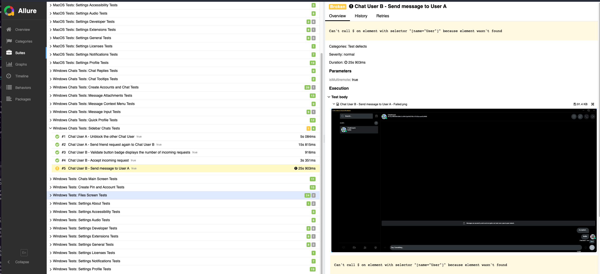

# Automated Testing Framework Aria Labels/UI Locators Guide

## Aria Labels

Under the Uplink repository code, several "aria_label" are added to elements from kit/src and UI/src inside the \*.rs files. These attributes are added to the UI elements from Uplink to be used later when creating locators to interact with the same elements inside the automated tests from Appium/WebdriverIO. When creating desktop builds for the application, these aria labels are added as "Accessibility ID" on macOS and Class Name/Automation ID on Windows. These are some of the preferred localization strategies used in automated frameworks due to reliability in identifying a single element and faster execution on tests instead of using Xpath, an alternative when no UI locators have been added to the elements yet.

## Screenobject Files

The files inside the folder /tests/screenobjects/ from this repository contain the definitions of UI locators from elements and the methods to interact with the same elements for a given screen or component. Depending on the complexity of the screen to test, you can find a single screenobject file to define the locators and methods from a component (example: Chats Sidebar on [`ChatsSidebar.ts`](../tests/screenobjects/chats/ChatsSidebar.ts)).

### Structure of Screenobject Files

[`Screenobject files`](../tests/screenobjects/) define a class that encapsulates the interaction with a UI sidebar, providing a structured and reusable way to interact with the UI elements and perform various actions and validations. The behavior of the class varies based on the current operating system.

#### Initial imports and declarations

Here, import statements with various constants and functions from other modules. These imports include constants related to the operating system, driver configurations, and helper functions.

#### Selectors declarations

As you can see, three objects are declared as constants containing the UI Selectors definition. One for standard selectors, which includes the selector definitions that are the same for Windows and macOS. One named SELECTORS_MACOS contains the selector definitions used only to locate macOS elements (usually starting with "~" and the accessibility ID/aria-label of the element). Finally, one named SELECTORS_WINDOWS contains the selector definitions used only to locate Windows UI elements (usually starting with '\[name="ARIA_LABEL"]'). The code determines the current operating system (currentOS) based on the driver and constants imported at the beginning. It selects different UI element selectors (SELECTORS) based on the operating system. It uses these selectors later to interact with UI elements.

#### Screen object Class declaration

A screen object/component object class is defined. Depending on which screen object class is declared, it can extend the class named UplinkMainScreen (for Files, Chats, or Friends screen components) or SettingsBaseScreen (for Settings) to inherit the shared functionality used during the entire application. A constructor is declared to pass the arguments required to declare for the parent class.

#### Getter Methods

The class includes a series of getter methods, each corresponding to a specific UI element within the sidebar. These methods locate and return elements using the specified selectors.

#### Methods to interact with the class

You can find here all the methods required to interact with the screen or component and the ones used along the test spec files.

## Test Spec Files

[`Spec files`](../tests/specs/) contains the test suites executed along the testing framework. Usually, they are structured in describe blocks, which contain a single test suite, and inside the describe blocks, you will find blocks containing a single test executed. Each test contains different steps that usually browse into a given UI element, interact with them, and finally make an assertion to verify the behavior is correct.

### Structure of Spec Files

Like the screen object files, the spec files usually have the same structure in the testing framework, and below is a description of the common parts you can find inside a spec file.

### Import Statements and Object Instantiations

A series of import statements that bring in various functions, classes, and constants from different modules within the project. These modules are organized into folders such as "helpers," "screenobjects," and others. Several different classes are created using the imported modules following the import statements. These instances represent different elements or components of the desktop application, such as layout, input bars, menus, and more. These instances are created for "User A" when the test is executed in a single instance and for "User B" when it is required to open more than one instance at the same time (for example: Chats and Friend Requests tests)

### Exported Test Function

The code exports an asynchronous function that contains the test suite or a collection of individual test cases since there are [`Suite files`](../tests/suites/) containing the test suites that will be executed depending on the job running the tests (MacOS, Windows and Windows Chats).

### Individual Test Cases

Several individual test cases are defined using the it function provided by the Mocha testing framework. Each test case is async and is described by a comment that explains its purpose. Each test case contains a series of steps that perform various actions on the desktop application's UI elements and then use WebdriverIO's assertions to validate the expected behaviors.

## Guidelines on how to ensure tests are not breaking

Now that we have explained how the testing framework screen object and spec files are structured, here are some tips and guidelines that developers can follow on their tests to contribute to facilitating the addition/update of UI Locators used in the automation testing framework and to avoid to break existing tests when an aria-label is updated.

### Identify if a code change in Uplink is breaking an existing test

When a PR is sent under the Uplink repository, the UI Automated Tests workflow jobs are triggered. First, it creates a build application for Windows and one for MacOS containing the changes under your commits. When the build jobs are finished, then there are three jobs starting:

#### Test MacOS

The job that executes all tests under the macOS application using a single instance of the application. Unfortunately, the multi-remote webdriverio option does not work with the Appium driver for MacOS, and there is no way so far to run tests using more than one instance at the same time. We are still researching how to run tests at the same time for more than one instance in MacOS, but for now, there are more than 150 tests executed inside a single instance of Uplink in MacOS, including validations on Create Account, Settings, Friends and Files screens.

#### Test Windows

The job that executes all tests under the Windows application requires only a single instance of Uplink. For now, more than 100 tests are executed inside a single instance of Uplink in Windows, including validations on the Create Account, Settings, and Files screens.

#### Test Windows Chats

The job that executes all tests under the Windows application requires two instances of Uplink. For now, more than 100 tests are executed using two instances simultaneously, including validations on creating two accounts under execution, passing the friend request process, and validations on the Chat Screen between the two users and on group chats.

### How to find if a test is failing under your Pull Request

The automated testing framework is designed to provide developers with as much feedback as possible. When the test jobs described above are completed, there are other supplementary steps in the workflow in charge of posting test results and deleting artifacts if tests are completed.

#### UI Tests Results Summary Comment

First, you will find a comment added to your PR sharing the number of tests executed and a summary of how many passed, failed, and skipped (tests requiring attention that are not executed now). The testing results will fail in the moment of failure of a single test. Then, if the PR contains a test-breaking change, the red cross symbol states a number greater or equal to 1. The comment is auto-updated every time a new commit under the PR triggers the test workflow.


### Allure Test Report on UI Automated Tests

Allure Report is a tool designed to report test results from CI automated test execution in a manner that is friendly to any user, regardless of their technical background. A comment containing a link to a GitHub pages site containing the Allure Test Results will be found in the PR. The comment is auto-updated every time a new commit under the PR triggers the test workflow. It is recommended to wait at least 5 minutes after the Automated Test workflow completes to review the link from the report (you might see an error page if you check it out immediately).


1. Click on the link to the report to show the Allure Report. You will see the main page of the report showing a pie chart with the test results and a summary of the test suites executed. You can click the "Show all" option to display all the executed test suites.


2. Once you are on the suites page, you will see a list of all the test suites executed, including each row a green number (tests passed), a grey number (tests skipped), and a yellow or red number (tests failed). To identify a test failing, go to the


3. Click on the test suite containing the yellow/red number greater than zero to find the test failing on the execution. A tree containing the tests inside the test suite (each test is a row) will be displayed. Click on the row containing the yellow or red indicator. You will see on the right side highlighted the error found during the test (in this example "Can't call $ on the element with selector "\[name="User"]" because the element wasn't found"). Also, if you go to the bottom right section, "Test Body", you can see an image attached that you can click to display in the report. This is the screenshot of the test failure. We are currently working on adding videos from the execution, so at some point, we will be able to see the error screenshot and a video of the execution of the test failed (work in progress).



In this case, we can see that the test is breaking because the UI element previously with Aria Label = "User" now has a different Aria Label/UI Locator or does not have one, so the testing framework cannot find it.

### Reasons for tests breaking

There could be different reasons causing a test to fail, for example:

- Aria Label modified in the source code - Example provided above. The screen object file must be updated in the testing repository to change the SELECTORS_WINDOWS and SELECTORS_MACOS to use the new aria-label.
- Texts modified in one section - There are tests asserting texts in UI elements, so the associated test will break if a UI element text is modified. Texts will have to be updated in the spec files to reflect the latest changes in the application.
- UI elements from tests removed or changed - Improvements during the application development are expected, then it is possible that a UI element is changed or eradicated due to a refactor in the code. Therefore, the tests associated with this element are going to break. In these cases, tests could be updated by adding the new UI locators into the corresponding screen object file or deleted from the testing repository since these are no longer valid.
- If an automated test is failing in a section that is not related to the one that your code changes are changing, then there is a possibility that the code is introducing an issue into the application. It is recommended to manually verify if the automated test failing is also failing by doing manual execution on the platform specified (MacOS or Windows).
- Same; if none of the previous reasons listed is the root cause of the test failing, it indicates that something in the code change might be introducing an issue in the application. It is recommended to manually verify if the automated test failing is also failing by doing manual execution on the platform specified (MacOS or Windows).

### How to add/update an aria-label for a new UI/Src element on Uplink

When adding new elements in /UI/Src files from the Uplink repository using common HTML elements, you can easily add a new aria-label to the element by adding the property "aria_label" and assigning a short value separated by dashes identifying the action performed by the element. Example on Uplink Repo (ui/src/layouts/storage/mod.rs - Line 287):

```rs
rsx!(
    p {
        class: "free-space",
        aria_label: "free-space-max-size",
        format!("{}", get_local_text("files.storage-max-size")),
        span {
            class: "count",
            format!("{}", storage_controller.read().storage_size.0),
        }
    },
```

### How to add/update an aria-label for a new UI/Src element defined on UI/Kit

There are elements from UI/Src in the Uplink repository already have the property aria label assigned as optional.

Examples:

- kit/src/components/context_menu
- kit/src/components/friends/friend
- kit/src/components/user
- kit/src/components/user_image_group
- kit/src/elements/button
- kit/src/elements/file
- kit/src/elements/folder
- kit/src/elements/input
- kit/src/elements/label
- kit/src/elements/textarea

It is possible to add an aria-label for the following elements by assigning the aria label property to the element and then adding the method .into(). For example, in the UI element based on the Button from kit/src/elements, the added aria-label is "aria-value".into(). Example from kit/src/components/embeds/file_embed/mod.rs - Line 294.

```rs
if with_download_button {
    rsx!(
        Button {
            icon: btn_icon,
            appearance: Appearance::Primary,
            aria_label: "attachment-button".into(),
            onpress: move |_| cx.props.on_press.call(()),
        }
    )
}
```

### How to add an aria-label for a new Kit UI element

This is the most complex case of adding aria labels when you need to add an aria-label into an element from kit/src, which can be assigned later to elements using this structure. In this case, you need to follow the next steps:

1. Add the property aria_label as an optional string into the definition of the public struct defined in the kit/src file. Below, you can find an example from kit/src/components/context_menu/mod.rs - Line 23

```rs
#[derive(Props)]
pub struct ItemProps<'a> {
    #[props(optional)]
    onpress: Option<EventHandler<'a, MouseEvent>>,
    text: String,
    disabled: Option<bool>,
    #[props(optional)]
    icon: Option<icons::outline::Shape>,
    #[props(optional)]
    danger: Option<bool>,
    should_render: Option<bool>,
    aria_label: Option<String>,
    #[props(optional)]
    children: Option<Element<'a>>,
}
```

2. Declare a variable named aria_label that will hold the value assigned to the label. This variable unwraps the value if it exists or returns a default value if it does not exist. To handle optional values in case the aria-label is not defined for all the elements using this structure. Below, you can find an example from kit/src/components/context_menu/mod.rs - Line 51

```rs
let aria_label = cx.props.aria_label.clone().unwrap_or_default();
```

3. Inside the rendering part of the code, when you declare the attributes from the HTML element, add a placeholder for the aria_label property, like the example below from kit/src/components/context_menu/mod.rs - Line 62:

```rs
cx.render(rsx!(
    button {
        class: format_args!("{class} {}", if disabled {"context-item-disabled"} else {""}),
        aria_label: "{aria_label}",
        onclick: move |e| {
            if !disabled {
                emit(&cx, e);
            }
        },
```

4. Once you have defined the aria-label property in the kit/src files, you can follow the steps from "How to add an aria-label for a new Kit UI element" to assign the label value to the elements based on the same structure.

### How to update the aria-label in the screen object file

1. First, go to the [`Screenobject files`](../tests/screenobjects/) and identify the file containing the selector declarations, depending on which component is being modified. Using the same example from above, adding an aria-label for the Attachment Button on file embeds on chat messages, you can find the selectors assignments in the [`Compose Attachment screen object file`](../tests/screenobjects/chats/ComposeAttachment.ts)

2. Now, with the file open, look for the selector declarations of the UI Element being affected. In this case, COMPOSE_ATTACHMENTS_BUTTON:

Windows Selectors:

```js
const SELECTORS_WINDOWS = {
  COMPOSE_ATTACHMENTS_BUTTON: "to-be-assigned",
};
```

MacOS Selectors:

```js
const SELECTORS_MACOS = {
  COMPOSE_ATTACHMENTS_BUTTON: "to-be-assigned",
};
```

3. Add the aria-label locator to each selector definition using the pattern below. Using the same example from above with the aria-label "attachment-button":

For Windows selectors:

```js
const SELECTORS_WINDOWS = {
  COMPOSE_ATTACHMENTS_BUTTON: '[name="attachment-button"]',
};
```

For MacOS selectors:

```js
const SELECTORS_WINDOWS = {
  COMPOSE_ATTACHMENTS_BUTTON: "~attachment-button",
};
```

4. After that, in the getter methods section of the file, create a getter method to locate the element:

```js
get composeAttachmentsButton() {
    return this.instance
      .$(SELECTORS.COMPOSE_ATTACHMENTS)
      .$(SELECTORS.COMPOSE_ATTACHMENTS_BUTTON);
  }
```

Notes:

- Instance (UserA or UserB) will be automatically obtained using the getter "instance" from the parent class "AppScreen"
- ".$()" is a function from webdriverIO to findElement and ".$$()" is the function to findElements.
- If the code chains multiple findElement functions, then the code will traverse the DOM tree to find the elements

5. Finally, in the methods to interact with the class section from the screen object file, you can create functions to interact with the elements declared before by using the WebdriverIO API methods. For example, to click on our composeAttachmentsButtons element, we can create the following method:

```js
async clickOnComposeButton() {
    await this.composeAttachmentsButton.click();
  }
```

Find more information about the WebdriverIO API methods in the following [`link`](https://webdriver.io/docs/api/element)

6. Any changes proposed to the testing-uplink repository must be sent within a pull request.

### How to add a new UI locator from an existing component in the screen object file

1. If the new UI locator to be added is part of a component from a screen object class previously declared, you can follow the steps mentioned above
2. However, if the new UI locator to be added is not part of a component from a screen object class previously declared, then there are no tests being affected by this and, therefore, will be added in the future by the time the tests for this new component are created

### How to update a test file being affected by an aria-label change

1. If a test is failing due to a recent change from the aria label assigned to the UI element, usually following the process from above to update the screen object selector should be enough to fix the tests interacting with the element
2. However, there are cases when the UI locator is not modified, but a property from the UI element is changed (the most common example is the text or default value). In this case, usually, the change that should be added to a test should be applied inside the [`Spec files`](../tests/specs/)
3. For example, there is one text display when no friends have been added yet in the application stating, "Things are better with friends.". Imagine that someday this message is changed to "No friends added yet!"

4. First, you must identify the test spec file containing the test failing. In this case, is [`Create Account Spec File`](../tests/specs/01-create-account.spec.ts)

```js
it("Validate Welcome Screen is displayed", async () => {
  await expect(welcomeScreenFirstUser.addSomeoneText).toHaveTextContaining(
    "Things are better with friends."
  );
});
```

5. Following the same example, one assertion validates that addSomeoneText contains the text "Things are better with friends.". This piece should be updated to the new text from the UI element. Our final code would look like this:

```js
it("Validate Welcome Screen is displayed", async () => {
  await expect(welcomeScreenFirstUser.addSomeoneText).toHaveTextContaining(
    "No friends added yet!"
  );
});
```

6. There are less common cases when the failing tests are unrelated to aria-label/ui locator or element property changes. In these cases, skipping the test initially (by adding the prefix "xit" to the test) is recommended, doing further research to find the reason for failure, and then applying the required changes to the spec or screen object files being affected. Here is an example of how to skip a test:

```js
xit("Validate Welcome Screen is displayed", async () => {
  // Steps executed in the test
});
```

7. Any changes proposed to the testing-uplink repository must be sent within a pull request.
